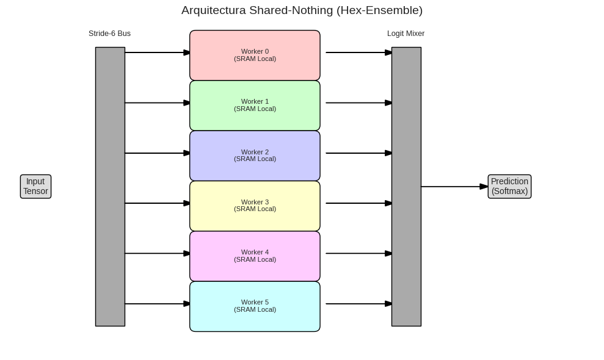

# Modular Isomorphism in Artificial Intelligence: From the Ring $\mathbb{Z}/6\mathbb{Z}$ to Shared-Nothing NPUs

[](https://github.com/NachoPeinador/Isomorfismo-Modular-Z-6Z-en-Inteligencia-Artificial/blob/main/README_es.md)
[](LICENSE)
[](https://pytorch.org/)
[](https://github.com/NachoPeinador/Isomorfismo-Modular-Z-6Z-en-Inteligencia-Artificial/blob/main/Paper/AI_Modular_Isomorphism.pdf)
[-success.svg)]()
[](https://doi.org/10.5281/zenodo.17777464)
[](https://colab.research.google.com/github/NachoPeinador/Isomorfismo-Modular-Z-6Z-en-Inteligencia-Artificial/blob/main/Notebooks/Validation_of_Shared_Nothing.ipynb)

**Author:** José Ignacio Peinador Sala  
**Contact:** [joseignacio.peinador@gmail.com](mailto:joseignacio.peinador@gmail.com)  
**ORCID:** [0009-0008-1822-3452](https://orcid.org/0009-0008-1822-3452) 

---

## 📜 Executive Summary

This repository presents a new architecture for Artificial Intelligence based on **Modular Isomorphism**, designed to break the dependency on monolithic, high-density chips.

Using the ring $\mathbb{Z}/6\mathbb{Z}$, we demonstrate that it is possible to decompose deep neural networks (MLPs and Transformers) into a "swarm" of 6 independent sub-networks (*Shared-Nothing*). This topology eliminates the need for global cache coherence and enables the construction of NPUs using **28nm chiplets**, reducing manufacturing costs by **18x** compared to 3nm nodes.


*> Schematic of the Hex-Ensemble NPU: Passive data distribution and processing across 6 isolated cores with no cross-communication.* 

---

## 🚀 Validation Milestone: Robustness and Inverse Generalization

The architecture has been experimentally validated, demonstrating that the "partial blindness" of the modules acts as a powerful structural regularizer.

| Metric | Validated Result | Reference |
| :--- | :--- | :--- |
| **MNIST Accuracy** | **97.03%** (vs 98.10% Monolithic) | |
| **Transformer (Val)** | **94.75%** (Inverse Generalization Gap) | |
| **Statistical Robustness** | **p-value = 0.0112** (Monte Carlo N=10) | *Notebook Analysis* |
| **Cost Reduction** | **18x** (Node Arbitration 28nm vs 3nm) | |
| **Isolation** | **Total (Shared-Nothing)** | |

---

## 📂 Repository Structure and 💻 Reproducibility

* **`Paper/`**: Scientific manuscript and theoretical demonstrations.
    * `AI_Modular_Isomorphism.pdf`: Full article detailing the *Stride-6* operator and economic analysis.
    * `AI_Modular_Isomorphism.tex`: LaTeX source code.
      
    * [](https://github.com/NachoPeinador/Isomorfismo-Modular-Z-6Z-en-Inteligencia-Artificial/blob/main/Paper/AI_Modular_Isomorphism.pdf)
      
* **`Notebooks/`**: Validation code and experiments.
    
    * [](https://colab.research.google.com/github/NachoPeinador/Isomorfismo-Modular-Z-6Z-en-Inteligencia-Artificial/blob/main/Notebooks/Validation_of_Shared_Nothing.ipynb)
       
        - **Tensor Isomorphism Test**: Mathematical verification of the decomposition $C = A \times B$ with error $< 10^{-5}$.
        - **Hex-Ensemble on MNIST**: Training of 6 blind workers with vote aggregation.
        - **Monte Carlo Analysis**: Statistical test confirming the reduction of overfitting in Modular Transformers.
* **`Images/`**: Architecture diagrams and convergence plots.

---

## ⚙️ Technical Innovation

### 1. Modular Projection Operator (Stride-6)
We formalize an operator $\mathcal{P}_r$ that projects dense tensors into 6 disjoint sub-spaces based on modular congruences. This transforms global matrix operations into parallelizable local operations.

### 2. Regularization via "Partial Blindness"
We discovered a phenomenon of **Inverse Generalization Gap**. By preventing each worker from seeing 83% of the data, the system is forced to learn robust features, avoiding noise memorization (Overfitting) and outperforming dense models on validation data.

### 3. Chiplet Economics (Node Arbitration)
The design enables the use of mature lithography processes (28nm) for competitive performance. By avoiding large reticles and defects of 3nm nodes, the effective cost per transistor drops dramatically, democratizing access to high-performance AI hardware.

---

## 🏛️ Theoretical & Computational Foundations

This Hex-NPU architecture is the third evolution of the **Modular Spectrum Theory**. Before being applied to Tensor Calculus and Artificial Intelligence, the *Shared-Nothing* paradigm verified its robustness in Number Theory and High-Performance Computing (HPC).

The mathematical guarantees of the **Stride-6** operator and the **DSP Isomorphism** rely on these two preceding works:

### 1. Algorithmic Validation: The Exascale $\pi$ Engine
**Repository:** [Arquitectura-de-Hibridacion-Algoritmica-en-Z-6Z](https://github.com/NachoPeinador/Arquitectura-de-Hibridacion-Algoritmica-en-Z-6Z)  
We proved that the **Chudnovsky algorithm** (the standard for calculating $\pi$) could be decomposed into 6 independent "polyphase channels".
* **Achievement:** Computed **100 Million digits** of $\pi$ using a *Shared-Nothing* architecture with 95% parallel efficiency.
* **relevance to AI:** Validated that complex global operations can be isomorphic to local modular operations without information loss.

### 2. Mathematical Genesis: The Modular Spectrum
**Repository:** [Espectro-Modular-Pi](https://github.com/NachoPeinador/Espectro-Modular-Pi)  
The foundational research that established the ring $\mathbb{Z}/6\mathbb{Z}$ as the optimal structure for parallel computation.
* **Core Theory:** Proved that prime number distribution ($6k \pm 1$) creates a natural "Prime Substrate" that allows for orthogonal channel separation.
* **Relevance to AI:** Provides the number-theoretic justification for why **6 workers** (and not 4 or 8) offer the optimal balance between channel density and sparsity.

---

## ⚖️ License and Usage (Dual Licensing)

This project uses a **Dual Licensing** model aligned with the principles of sustainable Open Science.

### ✅ Academic and Non-Commercial Use
The source code is distributed under the **PolyForm Noncommercial License 1.0.0**.
* **Permitted:** Research, education, and non-profit personal use.
* **Requirement:** Maintain attribution and this license notice.

### ⛔ Commercial Use
Any commercial use (products, SaaS services, consulting) is **strictly prohibited** without prior agreement.

> 💼 **Contact for Commercial Licenses:** [joseignacio.peinador@gmail.com](mailto:joseignacio.peinador@gmail.com) 

## ✍️ Citation

If you use this architecture or code in your research, please cite:

```bibtex
Peinador Sala, J. I. (2025). Modular Isomorphism in Artificial Intelligence: From the Ring Z/6Z to Shared-Nothing Architecture NPUs (Version v1). Zenodo. https://doi.org/10.5281/zenodo.17777464
```

---

## 🔬 Independent and Open Science

> *"Perfection is achieved, not when there is nothing more to add, but when there is nothing left to take away."* — **Antoine de Saint-Exupéry**

This work demonstrates that robust intelligence does not require the complexity of an interconnected monolith, but rather the elegance of efficient modules. Conducted independently to democratize access to high-performance hardware.

